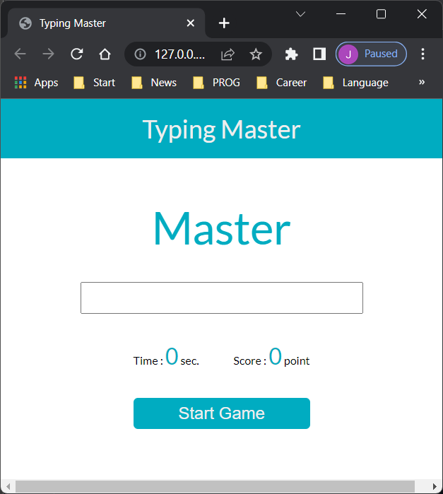

# Typeing Master App

## App Intro

- Typing practice application
- To start the app, just press "Start Game" button
- Within the time, you have to type the same word
- When you type the same word, you would have a point, and new word would be shown.
- When time is up, the game is to be over.

## UI Previews

## Applied Skills

Javascript (Vanilla) with the following functions

- DOM.addEventHandler('event', fn)
- setInterval(fn, millisec)
- setTimeout(fn, millisec)
- clearInterval(intervalName)

## Axios

- axios library applied to get restful api from a random word api server

## Ref

devspaces\visualstudiocode\javascript\codeScalper\js-vanilla-typingmaster
